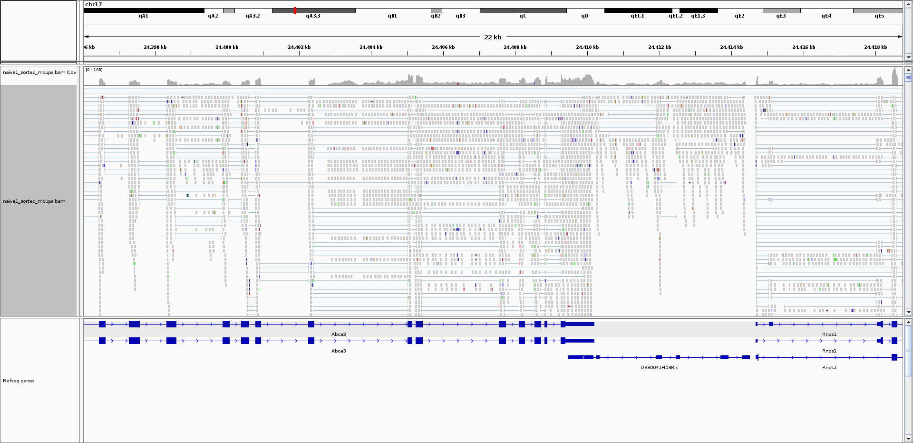

```{r setup, include=FALSE}
knitr::opts_chunk$set(echo = FALSE)
```

## IGV 1

```{r echo=F, out.width="100%", fig.align="left"}

```

## IGV 2

```{r echo=F}
knitr::include_graphics("figures/igv2.png")
```
