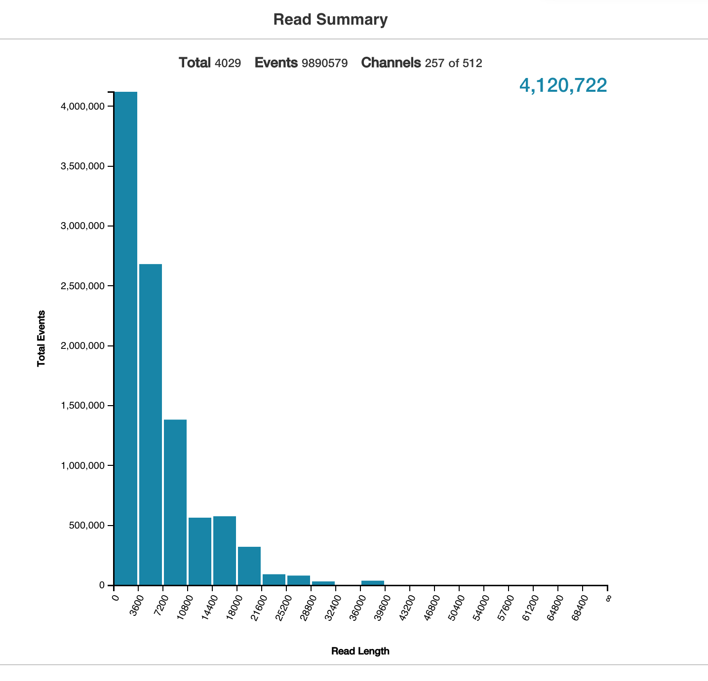

# Genomics

Genome is a collection of all genetic material in the organism. To be more accurate each cell in our body contains a copy of entire genome. The study of genomics is all things to do with genome including gene expression, methylation profiles, transcriptional factor binding, chromatic arrangements and three dimensional structure of chromosomes and many more things.

In this course we are going to focus on one particular technique of genomics - RNA sequencing or RNAseq for short. This is a study of primarily but not limited to gene expression. Other common application of RNAseq are study of splicing and isoforms.

In genomics everything rotates around sequence information, let's look into biological sequence next.

## Sequence

A sequence is a generic name describing the order of biological letters in molecules like DNA, RNA or piptide and protein. In the case of DNA and RNA letters mean nucleotide bases, **A**denine, **T**hymine, **C**ytosine **G**uanine or ATCG for short. Also know that mRNA contains **U**racil instead of Thymine. This would be one way to represent all five possible bases `A[T|U]CG`
In the case of piptide/protein molecules each letter means amino acid type, I won't list discuss proteins any further in this book since it isn't a focus on this book. 

Note that there is a greater nomenclature exists to cover all possible variances


```
##    Letter_code      Base_name
## 1            A        Adenine
## 2            C       Cytosine
## 3            G        Guanine
## 4          T|U Thymine|Uracil
## 5            R            A|G
## 6            Y            C|T
## 7            S            G|C
## 8            W            A|T
## 9            K            G|T
## 10           M            A|C
## 11           B          C|G|T
## 12           D          A|G|T
## 13           H          A|C|T
## 14           V          A|C|G
## 15           N       any base
```

The reason we have sequence information of any kind is because someone somewhere made an afford to sequence some part of the molecule. In the case of whole genome sequencing an afford was made to sequence the entire genome, for human the entire genome is 3 billion bases long. However this is a sum of all bases across all chromosomes, but chromosomes are not all equal, below is a sequence lenght of each chromosome.


```
##    Chrom    Length
## 1      1 248956422
## 2      2 242193529
## 3      3 198295559
## 4      4 190214555
## 5      5 181538259
## 6      6 170805979
## 7      7 159345973
## 8      8 145138636
## 9      9 138394717
## 10    10 133797422
## 11    11 135086622
## 12    12 133275309
## 13    13 114364328
## 14    14 107043718
## 15    15 101991189
## 16    16  90338345
## 17    17  83257441
## 18    18  80373285
## 19    19  58617616
## 20    20  64444167
## 21    21  46709983
## 22    22  50818468
## 23     X 156040895
## 24     Y  57227415
## 25    MT     16569
```

While sequence is a generic name and often times it needs some context around it, for example DNA sequence, RNA sequence or chromosome 3 sequence. There are other names like contig and a read, which are both sequences too, they mean more specific thing. 
In general both mean shorter sequence, where contig almost always should be longer then a read. 

Let's talk about a read sequence next.

## Read sequence

A read is product of a machine read out that takes some biological material i.e DNA or RNA sample and produces number of reads that resembles what you've put into the machine. There have been a few iteration of sequencing technologies, each iteration brings about higher yield (more reads) and longer reads. Current players in the genomics space are:

**Short read technologies**

- [Illumina](https://www.illumina.com/)

    - MiSeq
    - HiSeq
    - NextSeq
    - NovaSeq

- [BGI platforms](https://www.bgi.com/global/resources/sequencing-platforms/)

    - BGISEQ-50
    - BGISEQ-500

- [Ion Torrent](https://www.thermofisher.com/au/en/home/brands/ion-torrent.html)

**Medium to long read technologies**

- [PacBio](https://www.pacb.com/)

    - Sequel System

- [Oxford Nanopore](https://nanoporetech.com/)

    - MinION
    - GridION
    - PromethION

All of the above technologies will one way or another result in digital reads. As name implies short reads are typically 50-300 bases, whereas long reads can range from 1k to 10k or more. Usually the quantity and the length of the read are inversely proportional, however the throughput of a short reads technology at the moment is vastly greater then the long read and it doesn't suffer from the coverage issue.
In terms of number of reads we are talking about millions to billions for short reads technology and in the range of 1 to 4 millions for long reads. This is a good plot showing nanopore output, which illustrates quantity vs length nicely.

<div class="figure" style="text-align: left">

<p class="caption">(\#fig:unnamed-chunk-3)https://bioinformatics.stackexchange.com/questions/3623/how-many-reads-has-my-sequencing-run-produced-on-minion</p>
</div>

Getting the reads is just a first step. You have to do something with your reads. The two path one can take are really assemble your reads into contigs and further into full genome or map your reads to an existing reference genome. In this course we'll be taking the later path - mapping our RNAseq reads to an existing reference genome. But let me just talk a little more about what a contig sequence is next.

## Contig sequence

Contig has specific meaning in genome assembly. It is a larger fragment assembled from short (100-300 bp) reads that hasn't yet been merged into chromosome. However often times this term can be loosely used to mean any long stretch of sequence. I often (incorrectly) refer to chromosomes as different contigs in the FASTA file.
With long read technologies advancing pretty rapidly it breaks conventional definitions of a read and contig, where a single read can be longer then a contig. However assembling two long reads would still result in a contig sequence. So once again it is important to give more context when using this term.

## Summary

- **Genomics** is all things genome that rotates around genomic sequence
- **Sequence** is an ordered collection of nucleotide bases
- **Read** is an output from a sequencing machine that covered biological sample in digital sequence
- **RNAseq** focuses on gene expression and splicing isoforms
