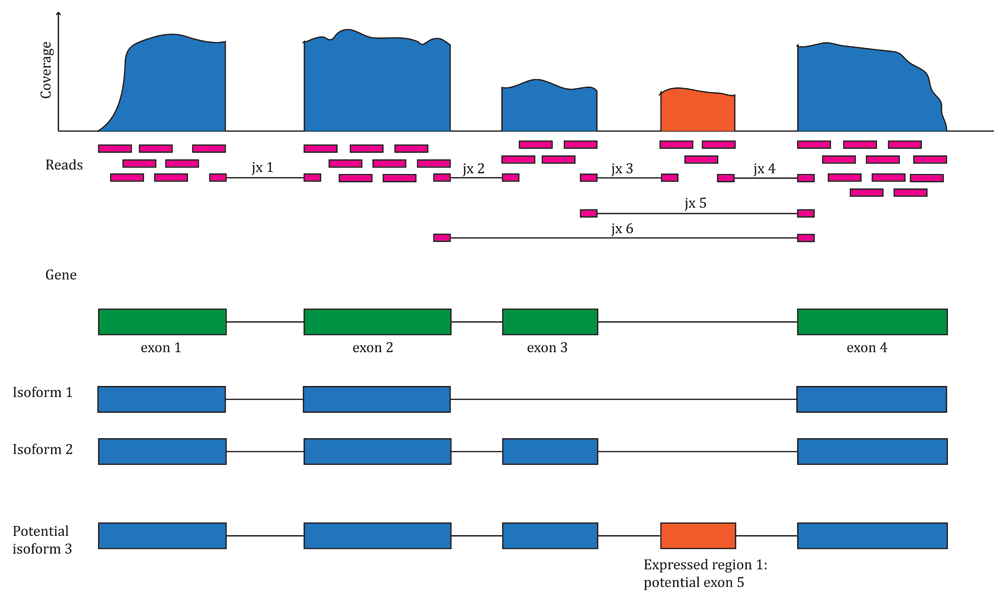

# Introduction to RNAseq {#index -}

These are course notes for the "Introduction to RNAseq" course given by the [Monash Bioinformatics Platform](https://www.monash.edu/researchinfrastructure/bioinformatics) for the [Monash Data Fluency](https://monashdatafluency.github.io/) initiative. Our teaching style is based on the style of [The Carpentries](https://carpentries.org/).

* [PDF version for printing](https://monashdatafluency.github.io/rnaseq-intro/rnaseq-intro.pdf)

### Source code {-}

* [GitHub page](https://github.com/MonashDataFluency/rnaseq-intro)

### Authors and copyright {-}

This course is developed for the Monash Bioinformatics Platform by Stuart Archer, Nick Wong and Kirill Tsyganov.

<!-- -->

This work is licensed under a [CC BY-4: Creative Commons Attribution 4.0 International License](http://creativecommons.org/licenses/by/4.0/). The attribution is "Monash Bioinformatics Platform" if copying or modifying these notes.
