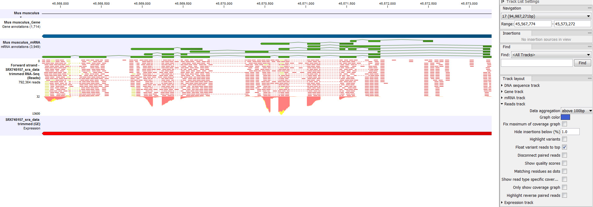

# RNAseq bioinformatics workflow 

Hands on bioinformatics starts from FASTQ files. You typically will get them from sequencing provider. However, as mentioned previously, everything you did in the lab before sequencing i.e RNA extraction, storage and handling as well as experimental design in general, feeds into bioinformatics analysis, so do try to record as much of that as possible and be ready to communicate this to a bioinformaticina.

## Alignment 

Once you've got your raw data - FASTQ files, the first thing you will do in RNAseq analysis is to map to the reference genome. How to find and select reference genome has been discussed [previously in reference sequence section](#reference-sequence). Here we are starting from an alignment step. Let's do another thought experiment; what information might you need from an aligner? A simpler question is; Once you've found which part of the genome a read belongs to, what information should you record? 

- which chromosome each read mapped to
- which coordinate on that chromosome read map to
- some quality metric on how well it mapped, all bases mapped or just some?

This is a bear minimum information you want your aligner to output, but there is actually a lot more information aligners typically output including was the read a multi-mapper, the orientation of read in terms of strand and position first or second, this is in the case of paired-end data. Some aligners like [STAR](https://github.com/alexdobin/STAR) also include information about splice junctions. Also with sample and UMI barcoding there are moves to ask aligners to record that information as well.

Essentially all aligners these days will produce a sequence alignment map or sam file for short. Sam file is once again is a simple plain text file with rows and columns tab separated, with a header section that is unique to a sam file. It is best practice to keep sam files zipped, but instead of conventional `gzip` utility use special for this purpose `samtools` utility and the convention is to call compressed files BAM for binary sam. An example below illustrates relatively extreme case, never the less show a massive advantage in disk space in using bam files instead of sam. 

```
-rw-r--r--  1 kirill kirill  41G Aug 30 14:01 cntr_rep1_sorted_mdups.bam
-rw-rw-r--  1 kirill kirill 399G Aug 31 11:06 cntr_rep1_sorted_mdups.sam
```

We always never store sam files on your disk. Always converted to bam files. Bam files are an industry standard, a lot of bioinformatics analysis, certainly true for RNAseq, rotates around bam files. There even some thoughts to keep raw data in bam files instead of FASTQs. 

One important thing you need to know about aligners is that broadly speaking there are two types, splice away aligners and splice unaware aligners. This is different from gapped alignment. Essentially any good aligners will do gapped alignment to account for insertions and deletions of few bases. However in the case of RNAseq some gaps can actually be quite large and can be few kilobases, those are the splice junctions. Below is a list of a few alingers that are commonly used in our group, but of course there are many more aligners out there.

Don't use these ones for RNAseq analysis, these ones are for DNA mapping, including data from ChipSeq and ATACseq.

Common splice unaware aligners:

- `bowtie2`
- `bwa`

These aligners commonly used for RNAseq analysis. You can use for ChipSeq and ATACseq as well, but best not to, unless you know what you are doing. This is mainly because these aligners will model gaps differently, since large gaps (splice junctions) are expected you might get wrong scoring of insertion and deletions in your Chip and ATAC seqs.

Common splice aware aligners:

- `tophat2`
- `hisat2`
- `STAR`

Let's talk a little more about bam files, before moving on to read counting as a step two in typical RNAseq analysis.

### Bam files

Bam files can be sorted in a couple of ways:

- by coordinate (4th column): arrange reads from first base till last base on each chromosome. Remember that chromosomes themselves may not be sorted by name or length
- by name (1st column): arrange reads alphabetically on each chromosome. Remember each read in a FASTQ file has a unique name (yes all 20 million or more reads).

The reason for name sorting is to place R1 and R2 reads next to each other (one after another), this mainly applicable for paired-end sequencing. I can't see any effect sorting by name single-end data, this will make it as random as not sorting at all. 
Sorting by coordinates is a dominant way of sorting bam files, big advantage of sorting by coordinates is ability to for quick lookup of any region with in the bam. You will need index bam files.

Remember that you should end up with one bam file per sample and typically each bam will be also sorted. You don't need both copies of sorted and unsorted bam files. Both contain the same information. Sorted bam files will result in slightly reduced bam file sizes, this is because sorted bam files will give slightly better compression. 

```
cntr_rep1_R1.fastq.gz	cntr_rep1.bam	cntr_rep1_sorted.bam
cntr_rep2_R1.fastq.gz	cntr_rep2.bam	cntr_rep2_sorted.bam
cntr_rep3_R1.fastq.gz	cntr_rep3.bam	cntr_rep3_sorted.bam

tp53_ko_rep1_R1.fastq.gz	tp53_ko_rep1.bam	tp53_ko_rep1_sorted.bam
tp53_ko_rep2_R1.fastq.gz	tp53_ko_rep2.bam	tp53_ko_rep2_sorted.bam
tp53_ko_rep3_R1.fastq.gz	tp53_ko_rep3.bam	tp53_ko_rep3_sorted.bam
```

## Read counting

Let's remind ourselves what an RNAseq data looks like if we visualise it. There are number of different 

<div class="figure">

<p class="caption">(\#fig:unnamed-chunk-1)[RNAseq data visualisation (follow a link for reference)](https://secure.clcbio.com/helpspot/index.php?pg=kb.page&id=380)</p>
</div>

<!-- -->

We typically should see reads only around feature, all reads should remain within the feature coordinates boundary. Reads should pile up on exons with clear boundaries between adjacent exons. Reads can and do map anywhere though and then reads fall outside of "normal" regions it could be an interesting case to follow up. It does by in large starts with some visualisation, which often can be rather manual.

A few things to know when visualising RNAseq data:

- use the same reference sequence that you mapped against, otherwise you might see more variance between reference genome and the data
- be sure to visualise against the same annotation version and vendor type. This will ensure that your features (boxes) align best with your data. This is more important then picking the same reference files as features do change coordinates from version to version. Therefore if you are using different version of annotation to which you used for read assignment for visualisation you might see too many reads outside your feature boundaries, leading to false sense that there is some biological effect going on.
- typically RNAseq viewers sub-sample your data for visualisation purposes. This is mainly for speed and performance of the viewer. This is especially for highly expressed genes with deep read coverage. Be aware of that when doing your exploratory analysis. Often times you can turn sub-sampling off. Once again not seeing all of the data may result in misleading observations.

Having remind ourselves what RNAseq data 

After you've mapped reads to the reference genome you need to count number of reads that actually mapped to a feature. Feature could mean several things, it is some region of DNA that has some value/interest, a protein coding gene is a DNA region that produces a protein. For the purpose of RNAseq experiment we are most likely interested in protein coding features and therefore need to count how many of our total library mapped to features. For this step we need an annotation of the reference genome and a bam file with coordinates for every read mappings.


<div class="figure">

<p class="caption">(\#fig:unnamed-chunk-3)https://htseq.readthedocs.io/en/release_0.10.0/count.html</p>
</div>

### Lingo re feature counting

- feature
- intragenic/interegenic regions
