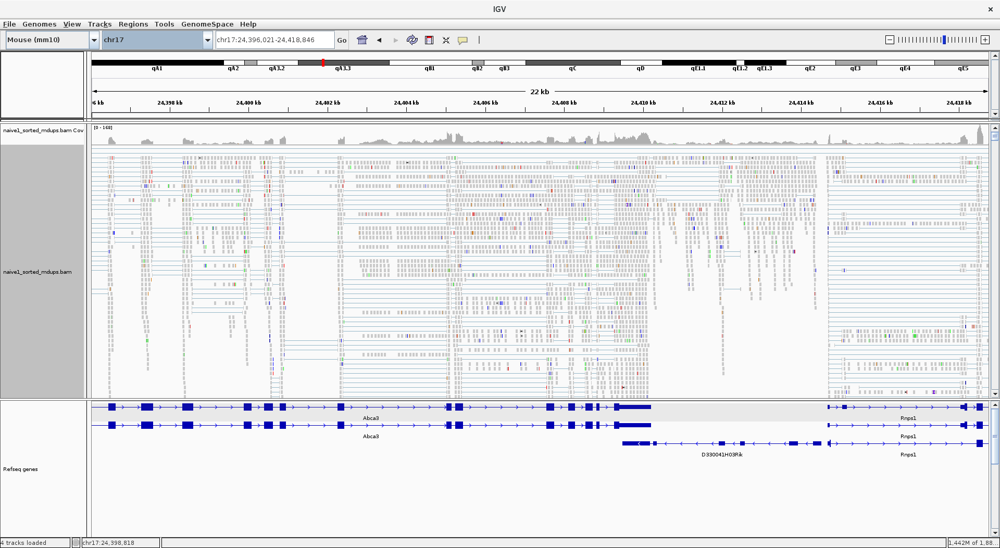
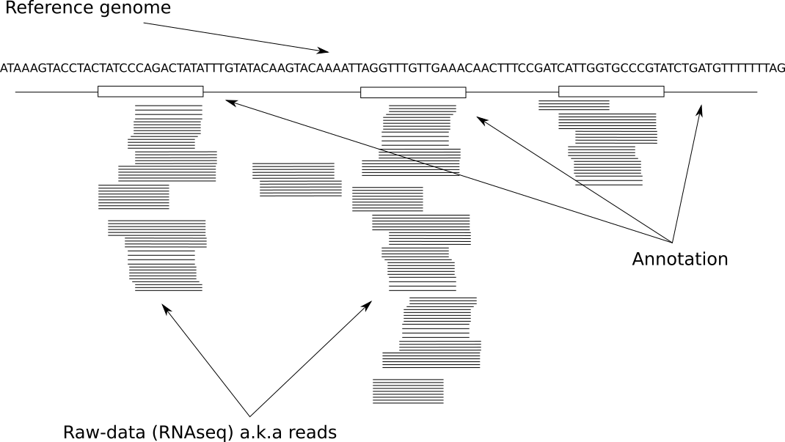

# RNAseq bioinformatics workflow

Hands on bioinformatics starts from FASTQ files. You typically will get them from sequencing provider. However, as mentioned previously, everything you did in the lab before sequencing i.e RNA extraction, storage and handling as well as experimental design in general, feeds into bioinformatics analysis, so do try to record as much of that as possible and be ready to communicate this to a bioinformaticina.

## Adapter trimming

Relatively important concept that hasn't yet been discussed is the way aligners map reads. Most aligner these days can map in either one of two modes:

- end-to-end mapping: meaning that aligner forcing a read to map from start to end, but still allowing gaps to be inserted.

<div class="figure">

<p class="caption">(\#fig:unnamed-chunk-1)End to end alignment</p>
</div>
- soft-clipping: is when aligner allowed to disregard ends of the reads but still map the the bit in the middle of the read

<div class="figure">

<p class="caption">(\#fig:unnamed-chunk-2)Soft clipping alignment</p>
</div>

Soft-clipping is the default mode on STAR aligner and is mine preferred approach to map reads.  

## Alignment

Once you've got your raw data - FASTQ files, the first thing you will do in RNAseq analysis is to map to the reference genome. How to find and select reference genome has been discussed [previously in reference sequence section](#reference-sequence). Here we are starting from an alignment step. Let's do another thought experiment; what information might you need from an aligner? A simpler question is; Once you've found which part of the genome a read belongs to, what information should you record?

- which chromosome each read mapped to
- which coordinate on that chromosome read map to
- some quality metric on how well it mapped, all bases mapped or just some?

This is a bear minimum information you want your aligner to output, but there is actually a lot more information aligners typically output including was the read a multi-mapper, the orientation of read in terms of strand and position first or second, this is in the case of paired-end data. Some aligners like [STAR](https://github.com/alexdobin/STAR) also include information about splice junctions. Also with sample and UMI barcoding there are moves to ask aligners to record that information as well.

Essentially all aligners these days will produce a sequence alignment map or sam file for short. Sam file is once again is a simple plain text file with rows and columns tab separated, with a header section that is unique to a sam file. It is best practice to keep sam files zipped, but instead of conventional `gzip` utility use special for this purpose `samtools` utility and the convention is to call compressed files BAM for binary sam. An example below illustrates relatively extreme case, never the less show a massive advantage in disk space in using bam files instead of sam.

```
-rw-r--r--  1 kirill kirill  41G Aug 30 14:01 cntr_rep1_sorted_mdups.bam
-rw-rw-r--  1 kirill kirill 399G Aug 31 11:06 cntr_rep1_sorted_mdups.sam
```

We always say that you should never store sam files on disk. Always convert them to bam files. Bam files are an industry standard, a lot of bioinformatics analysis, rotates around bam files. There even some thoughts to keep raw data in bam files instead of FASTQs.

One important thing you need to know about aligners is that broadly speaking there are two types, splice away aligners and splice unaware aligners. This is different from gapped alignment. Essentially any good aligners will do gapped alignment to account for insertions and deletions of few bases. However in the case of RNAseq some gaps can actually be quite large and can be few kilobases, those are the splice junctions. Below is a list of a few alingers that are commonly used in our group, but of course there are many more aligners out there.

Don't use these ones for RNAseq analysis, these ones are for DNA mapping, including data from ChipSeq and ATACseq.

Common splice unaware aligners:

- `bowtie2`
- `bwa`

These aligners commonly used for RNAseq analysis. You can use for ChipSeq and ATACseq as well, but best not to, unless you know what you are doing. This is mainly because these aligners will model gaps differently, since large gaps (splice junctions) are expected you might get wrong scoring of insertion and deletions in your Chip and ATAC seqs.

Common splice aware aligners:

- `tophat2`
- `hisat2`
- `STAR`

Let's talk a little more about bam files, before moving on to read counting as a step two in typical RNAseq analysis.

### Bam files

Bam files can be sorted in a couple of ways:

- by coordinate (4th column): arrange reads from first base till last base on each chromosome. Remember that chromosomes themselves may not be sorted by name or length
- by name (1st column): arrange reads alphabetically on each chromosome. Remember each read in a FASTQ file has a unique name (yes all 20 million or more reads).

The reason for name sorting is to place R1 and R2 reads next to each other (one after another), this mainly applicable for paired-end sequencing. I can't see any effect sorting by name single-end data, this will make it as random as not sorting at all.
Sorting by coordinates is a dominant way of sorting bam files, big advantage of sorting by coordinates is ability to for quick lookup of any region with in the bam. You will need index bam files.

Remember that you should end up with one bam file per sample and typically each bam will be also sorted. You don't need both copies of sorted and unsorted bam files. Both contain the same information. Sorted bam files will result in slightly reduced bam file sizes, this is because sorted bam files will give slightly better compression.

```
cntr_rep1_R1.fastq.gz	cntr_rep1.bam	cntr_rep1_sorted.bam
cntr_rep2_R1.fastq.gz	cntr_rep2.bam	cntr_rep2_sorted.bam
cntr_rep3_R1.fastq.gz	cntr_rep3.bam	cntr_rep3_sorted.bam

tp53_ko_rep1_R1.fastq.gz	tp53_ko_rep1.bam	tp53_ko_rep1_sorted.bam
tp53_ko_rep2_R1.fastq.gz	tp53_ko_rep2.bam	tp53_ko_rep2_sorted.bam
tp53_ko_rep3_R1.fastq.gz	tp53_ko_rep3.bam	tp53_ko_rep3_sorted.bam
```

## Read counting

### Introduction

Before leaping into what read counting is let's remind ourselves quickly what an RNAseq data looks like if we visualise it. There are number of different applications that you can use to visualise, but the one we most commonly use is [Integrative Genomics Viewer (IGV)](http://software.broadinstitute.org/software/igv/)

<div class="figure">

<p class="caption">(\#fig:unnamed-chunk-3)IGV browser view of one sample</p>
</div>

Typically however there are multiple samples you'd be looking, which I left out from the image for clarity of view.

Here is schematic view of what you typical see in a genome viewer

<!-- -->

The three things that we always need for visualisation of that kind are:

- reference genome file (FASTA)
- annotation file (GTF/GFF)
- data:

    - bam: these are information reach, but slow to load and navigate
    - bigWig: one example of coverage plot file, just show the coverage, samll and quick
    - vcf: variant information, not part of this course

Note that something like IGV already comes with in built reference and annotation files, but just remember that it's likely comes with different version of the genome. Often time IGV reference files will be good enough for first look and if you start suspecting something you should load your specific reference.

> Go through igv screen shoots and explain few different concenpts, like overlapping features

Now that we've recapped what RNAseq data typically looks like lets talk how we approach read counting bioinformatically

### Table of counts

Given an alignment map file a.k.a bam file and an annotation file e.g GTF we need to systematically go through every read in the bma file and assign it to a feature in the annotation file. Ultimately we would like to get contiguous table or simply, table of counts, where each row is a gene and columns are our samples. Here is a top few lines from typical table of counts.

```
Gene.ID	Chrom	Gene.Name	Biotype	KO3_S3	KO4_S4	WT1_S1	WT2_S2
ENSMUSG00000051951	1	Xkr4	protein_coding	0	0	0	0
ENSMUSG00000025900	1	Rp1	protein_coding	0	0	0	0
ENSMUSG00000109048	1	Rp1	protein_coding	0	0	0	0
ENSMUSG00000025902	1	Sox17	protein_coding	0	0	0	0
ENSMUSG00000033845	1	Mrpl15	protein_coding	934	1317	888	939
ENSMUSG00000025903	1	Lypla1	protein_coding	705	848	647	747
ENSMUSG00000104217	1	Gm37988	protein_coding	0	0	0	0
ENSMUSG00000033813	1	Tcea1	protein_coding	354	436	368	442
ENSMUSG00000002459	1	Rgs20	protein_coding	0	0	0	0
```

Note that this table has a few extra columns with some extra information, those aren't strictly necessary, but do allow to put things into biological picture.

This table would be minimal information you need for differential analysis. Note that `Gene.ID` column has to be unique values.

```
Gene.ID	KO3_S3	KO4_S4	WT1_S1	WT2_S2
ENSMUSG00000051951	0	0	0	0
ENSMUSG00000025900	0	0	0	0
ENSMUSG00000109048	0	0	0	0
ENSMUSG00000025902	0	0	0	0
ENSMUSG00000033845	934	1317	888	939
ENSMUSG00000025903	705	848	647	747
ENSMUSG00000104217	0	0	0	0
ENSMUSG00000033813	354	436	368	442
ENSMUSG00000002459	0	0	0	0
```

In RNAseq we typically should see reads only around feature, all reads should remain within the feature coordinates boundary. Reads should pile up on exons with clear boundaries between adjacent exons. Reads can and do map anywhere though and if reads fall outside of "normal" regions it could be an interesting case to follow up. As illustrated before visualisation is very important part of working with RNAseq data.

A few things to know when visualising RNAseq data:

- use the same reference sequence that you mapped against, otherwise you might see more variance between reference genome and the data
- be sure to visualise against the same annotation version and vendor type. This will ensure that your features (boxes) align best with your data. This is more important then picking the same reference files as features do change coordinates from version to version. Therefore if you are using different version of annotation to which you used for read assignment for visualisation you might see too many reads outside your feature boundaries, leading to false sense that there is some biological effect going on.
- typically RNAseq viewers sub-sample your data for visualisation purposes. This is mainly for speed and performance of the viewer. This is especially for highly expressed genes with deep read coverage. Be aware of that when doing your exploratory analysis. Often times you can turn sub-sampling off. Once again not seeing all of the data may result in misleading observations.

### Details

We normally use words like "counting features" or "read assignment to features", all means the same obtain table of counts. It is important to appreciate that "feature" could mean several things, it is some region of DNA that has some value/interest, a protein coding gene is a DNA region that produces a protein. For the purpose of RNAseq experiment we are most likely interested in protein coding features and therefore need to count those.

Similar to aligners there are number of tools out there that do read counting, but the two most popular are:

- [htseq-count](https://htseq.readthedocs.io/en/release_0.10.0/index.html)
- [featureCounts](http://subread.sourceforge.net/)

One thing to mention is that STAR aligner, mentioned previously, can actually output count files as well. In essence one can do most of RNAseq processing with STAR aligner.


I'm most familiar with how `featureCounts` works and it is a versatile tool, by default it counts reads that mapped to exons, which are referred as features, and summarises at meta-feature level which by default are gene. The number that ends up in the table of counts is a sum of all of reads from exons in a give gene. Remember that if a read overlaps more then one feature, by default, it is marked as an ambiguous read and isn't counted toward a feature. It is possible to summarise reads at exon level which opens a possibility for differential exon usage analysis from RNAseq, something that isn't covered in this course.

We are going to through more QC's in the next section but here is nice summary image from `htseq-count` docs, to cement all possible read assignment problems.

<div class="figure">

<p class="caption">(\#fig:unnamed-chunk-5)https://htseq.readthedocs.io/en/release_0.10.0/count.html</p>
</div>

The final step in RNAseq analysis is to take table of counts and apply statistical modeling to study differential expressions of genes. This will be covered in later sections.


## RNAseq checklist

Having introduced you to and RNAseq workflow below is a checklist for you to take home. It is broken into three sections, must, should and up to you, reflecting the type of information needed for the analysis. However remember that computer will always give you an answer based on the information you are going to feed into it. It is in your best interests to provide as much information about your experiment as you can to the bioinformatician for most accurate analysis.

The short answer to a typical question by researcher to a bioinformatician; "What do you need to know about the experiment?" Everything ! but here is a break down of everything:

### Must

If the below information isn't give I can't really do the analysis

- Have you got raw (FASTQ) files?
- What is your model organism?
- Which reference database to use? (e.g. ucsc, ensembl, refseq)
- Additional reference files e.g transgenes? will need relevant files (FASTA , GTF/GFF)
- Do you have a samples sheet for me?

### Should

I'm saying should, but really the more information you provide the more
accurate - more reflective analysis is going to be of your biological experiment

- Have I got enough explanation about experimental design including:
    - Any batch effects. Paired-data (eg. individual before/after treatment)
    - Comparisons of interest.  Pairwise? Interaction?
    - Additional factors for contrast matrix:
        - sample pairing
        - sex
        - time points
        - phenotype
        - stimulus
        - other..

### Up to you

This is your experiment and your money and time spend on it. I'm just saying
that there are instrument to instrument variations and biases. As well as
certain artifacts due to particular library preparation method. On top of that
you'll need this information if you are going to publish your results in a paper anyway.

- Which sequencing facility was doing the sequencing?
- Library preparation info:
    - library type: single or paired end
    - preparation method ribo-depletion or poly(A), other
    - was library stranded
    - name of preparation kit was used
- Sequencer used (e.g HiSeq1500, NovaSeq, NextSeq etc)
- Are you keeping a copy of your raw data somewhere safe

**Remember that the best practice is to gather all of the information in the checklist before the analysis**

## Summary

- RNAseq analysis is a relative measure of reads between samples.
- step one in RNAseq analysis is to get bam files
- step two in RNAseq analysis is to get table of counts.
- step three in RNAseq analysis do differential expression

> Question: What is the correct order for an alignment based RNAseq workflow?

- differential expression, mapping, read counting
- read counting, mapping, differential expression
- mapping, read counting, differential expression
- differential expression, read counting, mapping

